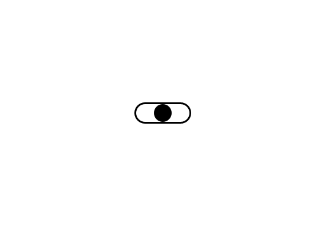

## About

A normal toggle switch in html have only two states. But two is not enough for me, so i made three.
You can add different functionality based on the state of this toggle switch. In this example, the code allow users to change the background color of a webpage using the tri-state toggle switch. This code is based on simple html, css and javascript.
